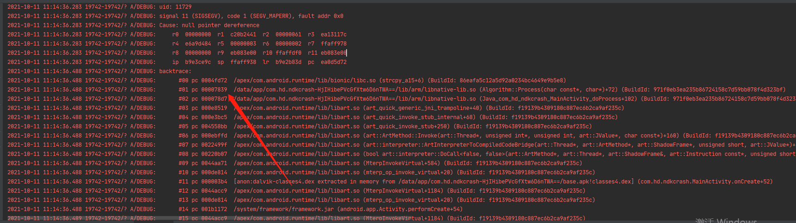
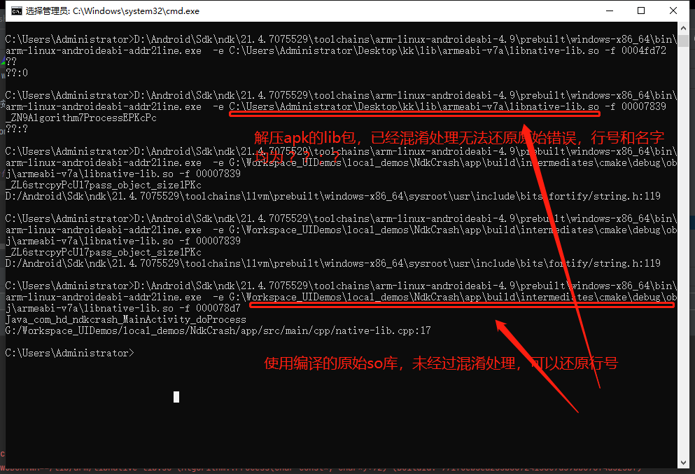

#### 参考博客：

博客1：https://mp.weixin.qq.com/s/FTPLUyJGgAK10k5upqkVlw

博客2：https://blog.csdn.net/afei__/article/details/81181827

编译器在编译时对函数名按照一定的规则进行了优化，既然规则是一定的，那么当然也有人做出了还原方法，如 
还原方法为原名字：
https://demangler.com/

NDK下载地址：https://developer.android.com/ndk/downloads?hl=zh-cn

####  addr2line 还原c代码的错误点

步骤1：查看错误的内存地址

步骤2：还原错误行：

方案1：使用apk中的so，只能输出错误函数，借助 https://demangler.com/ 还原函数名字

为 Algorithm::Process(char const*, char*)

方案2：使用未处理过的原始so(app\build\intermediates\cmake\debug\obj\armeabi-v7a\***.so)，输出错误为native-lib.cpp:17

